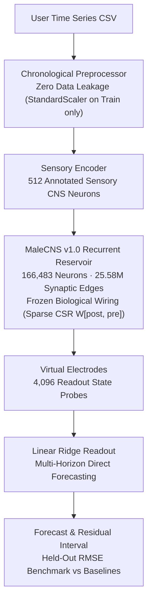

# FlyCast

> **Can a fruit fly predict the future?**

FlyCast turns the experimentally reconstructed **MaleCNS v1.0** *Drosophila melanogaster* connectome into a fixed recurrent computational reservoir.

Upload any time series. Run it through ~166K biological neurons and 25.5M synapses. Train a lightweight readout. See whether the biological wiring of a real nervous system can predict what comes next.

---

## Architecture



---

## Why This Exists

Most modern neural networks are described as *"brain-inspired"*.

FlyCast asks a radically different, foundational question:

> **Can an actual evolved biological nervous system be useful as a physical recurrent computer?**
>
> Does the true, experimentally measured synaptic wiring of a fruit fly provide computational utility (memory, separation, nonlinear mixing) compared to classical autoregression or weight-scrambled controls?

FlyCast is not a vague simulation or conceptual artwork: **every single prediction depends mathematically on recurrent state propagation through the sparse CSR matrix of the MaleCNS connectome.**

---

## Honest Science

FlyCast adheres to strict scientific honesty:
- **No Fabricated Metrics:** Experiments are evaluated on held-out test data (chronological 70% Train / 15% Validation / 15% Test split).
- **If the Fly Loses, It Shows It:** If an autoregressive Ridge baseline or naive persistence outperforms the connectome, the interface announces it clearly: *"THE FLY HAS SPOKEN. It should have kept quiet."*
- **Scientific Control:** Includes an optional weight-shuffled control that preserves exact network topology and weight distributions while scrambling connection magnitudes, testing whether the specific biological weights matter.
- **Never Overclaims:** Clearly distinguishes structural connectomics from electrophysiology, ion channel dynamics, or living fly thoughts. (See [`SCIENTIFIC_NOTES.md`](./SCIENTIFIC_NOTES.md)).

---

## How It Works

1. **The Substrate (MaleCNS v1.0):**
   - 166,691 identified neurons across the male fruit-fly central nervous system (brain, optic lobes, ventral nerve cord).
   - 25.58 million directed synaptic connections.
   - Converted into a high-performance Compressed Sparse Row (CSR) matrix with `W[post, pre]` orientation so activity flows presynaptic $\to$ postsynaptic.
   - Synaptic contact counts scaled via $w = \log(1 + \text{synapses})$ with incoming $L_1$ normalization.

2. **Sensory Projection:**
   - 512 annotated sensory neurons receive the input signal through fixed deterministic coefficients sampled from $\text{Uniform}(-1, +1) \times \text{gain}$.

3. **Recurrent Dynamics:**
   - Leaky rate Echo State Network model:
     $$x[t+1] = (1 - \text{leak}) x[t] + \text{leak} \cdot \tanh(\text{gain} \cdot W x[t] + W_{in} u[t])$$
   - Connectome weights remain completely **frozen**.

4. **Linear Readout:**
   - 4,096 virtual electrodes sample internal network states at each timestep.
   - Multi-horizon direct Ridge regression ($y[t+1], \dots, y[t+H]$) is trained on reservoir states.
   - Ridge regularization $\alpha$ is selected on the validation set; evaluation is performed on held-out test data.

---

## Repository Structure

```text
Flycast/
├── README.md
├── LICENSE                     # MIT License
├── DATA_LICENSE.md             # MaleCNS CC BY 4.0 attribution
├── SCIENTIFIC_NOTES.md         # Observed biology vs engineered choices
├── scripts/
│   └── smoke-test.sh           # End-to-end local automated test script
├── backend/
│   ├── Dockerfile
│   ├── railway.toml
│   ├── requirements.txt
│   ├── .env.example
│   ├── scripts/
│   │   ├── start.sh            # Production container boot script
│   │   └── build_brain.py      # Connectome builder & validator
│   ├── app/
│   │   ├── main.py             # FastAPI entrypoint & healthcheck
│   │   ├── config.py           # Pydantic configuration
│   │   ├── brain/              # Connectome loader, reservoir, fixture, controls
│   │   ├── forecasting/        # Preprocessing, readout, baselines, metrics, pipeline
│   │   ├── jobs/               # Asynchronous thread pool manager & TTL cleanup
│   │   ├── demos/              # Chaotic Lorenz, Seasonal, Oscillator generators
│   │   └── api/                # REST routes (/health, /brain, /demos, /experiments)
│   └── tests/                  # Pytest test suite (12 unit and integration tests)
└── frontend/
    ├── Dockerfile              # Multi-stage production Next.js build
    ├── railway.toml
    ├── package.json
    ├── next.config.mjs
    ├── tailwind.config.ts
    ├── app/
    │   ├── page.tsx            # Landing page
    │   ├── experiment/         # Staged upload, configuration, and live results
    │   ├── method/             # Detailed scientific methodology
    │   └── about/              # Observed vs engineered disclosures
    ├── components/             # Recharts visualization, activity monitors, scorecards
    └── lib/                    # API client, types, formatting
```

---

## Running Locally

### 1. Backend

```bash
cd backend

# Create virtual environment
python3 -m venv .venv
source .venv/bin/activate

# Install dependencies
pip install -r requirements.txt

# Run in lightweight fixture mode (instant test graph, 300 neurons)
USE_FIXTURE_BRAIN=true uvicorn app.main:app --reload --port 8000
```

### 2. Frontend

```bash
cd frontend

# Install Node dependencies
npm install

# Start Next.js development server
npm run dev
```

Visit [http://localhost:3000](http://localhost:3000).

---

## Building the Full MaleCNS Connectome

To download and build the full 166K-neuron MaleCNS v1.0 graph from Google Cloud Storage:

```bash
cd backend
DATA_DIR=./data python -m app.brain.bootstrap
```

*Note: The raw connectome graph is ~1.1 GB. The bootstrap script automatically downloads the source Feather files, processes them into high-efficiency CSR sparse NumPy arrays (`weights.npy`, `indices.npy`, `indptr.npy`, `body_ids.npy`), and removes temporary raw files to preserve disk space.*

---

## Automated Verification & Tests

### Backend Tests

Run the complete test suite (includes directionality test, zero data leakage test, no fake brain test, baselines, and API lifecycle):

```bash
PYTHONPATH=backend backend/.venv/bin/pytest backend/tests/
```

### Frontend Typecheck & Build

```bash
npm run typecheck --prefix frontend
npm run build --prefix frontend
```

### End-to-End Smoke Test

Run the automated smoke test script, which starts a local backend, submits a synthetic experiment, polls for completion, and verifies metrics and CSV downloads:

```bash
./scripts/smoke-test.sh
```

---

## Deploying to Railway

FlyCast is designed for zero-friction deployment on [Railway](https://railway.app):

1. **Create a Railway Project** linked to your GitHub repository.
2. **Add Service 1: `flycast-backend`**
   - Root Directory: `/backend`
   - Volume: Mount a persistent volume at `/data` (recommended: 1 GB or higher).
   - Environment Variables:
     - `DATA_DIR=/data`
     - `ALLOWED_ORIGINS=https://<your-frontend-domain>.up.railway.app`
3. **Add Service 2: `flycast-frontend`**
   - Root Directory: `/frontend`
   - Environment Variables:
     - `NEXT_PUBLIC_API_BASE_URL=https://<your-backend-domain>.up.railway.app`
4. Deploy! The backend container will automatically initialize the connectome on first boot into `/data/brain`.

---

## Attribution & Licenses

- **MaleCNS Connectome Data:** HHMI Janelia FlyEM, University of Cambridge, MRC Laboratory of Molecular Biology, and Google Research. Licensed under **CC BY 4.0** (see [`DATA_LICENSE.md`](./DATA_LICENSE.md)).
- **Application Code:** Licensed under the **MIT License** (see [`LICENSE`](./LICENSE)).
